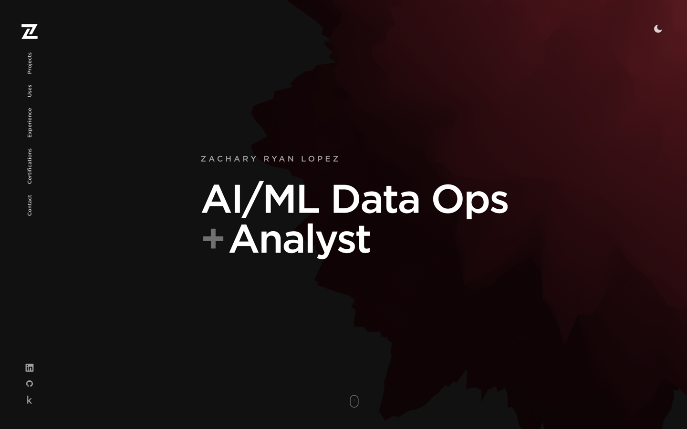

# zrl.dev

[](https://zrl.dev)
[](https://zrl.dev/tools)
[](https://github.com/zrlopez/zrl.dev/actions/workflows/secured_ci.yml)
[](https://app.codacy.com/gh/zrlopez/zrl.dev/dashboard?utm_source=gh&utm_medium=referral&utm_content=&utm_campaign=Badge_grade)
[](https://app.codacy.com/gh/zrlopez/zrl.dev/dashboard?utm_source=gh&utm_medium=referral&utm_content=&utm_campaign=Badge_coverage)
[](./LICENSE)

<p align="center">
  
</p>

**[zrl.dev](https://zrl.dev)** — portfolio of **Zachary Ryan Lopez**, AI/ML Data Operations Analyst (Austin, TX).

Annotation QA · ML incident response · durable agent systems · the tools behind them.

This repository is itself a portfolio artifact: live demo, hardened contact path, CI/security surface, and case-study depth — not a template dump.

## If you only have 5 minutes

1. **Live site:** [zrl.dev](https://zrl.dev)
2. **Flagship demo:** [Annotation Analytics Dashboard](https://zrl.dev/projects/annotation-dashboard#live-demo) — 6-tab interactive analytics
3. **Case studies:** [AI Agent Platform](https://zrl.dev/projects/ai-agent-platform) · [ML Incident Response](https://zrl.dev/projects/ml-incident-response)
4. **Stack / skills:** [Tools & Skills](https://zrl.dev/tools)
5. **This repo:** CI (secret scan · CodeQL · coverage → Codacy) · Turnstile contact · dual Vercel/CF build shape

## Design intent

| | |
|--|--|
| **Role signal** | AI/ML data operations — annotation QA, incident response, agent systems |
| **What is live** | Full Remix app on Vercel; annotation demo is runnable in-browser |
| **What is intentional** | Case-study depth over feature count; quiet chrome; Harvard Crimson system |
| **Security surface** | Turnstile + Resend contact, CSP/nonce, rate-limit path, `security.txt`, secured CI |

## Routes

| Path | |
|------|--|
| [`/`](https://zrl.dev/) | Intro, featured projects, profile |
| [`/projects`](https://zrl.dev/projects) | Project archive |
| [`/projects/annotation-dashboard`](https://zrl.dev/projects/annotation-dashboard#live-demo) | **Live** annotation analytics demo (6 tabs) |
| [`/projects/ai-agent-platform`](https://zrl.dev/projects/ai-agent-platform) | Cross-agent orchestration case study |
| [`/projects/ml-incident-response`](https://zrl.dev/projects/ml-incident-response) | MLOps incident / runbook system |
| [`/tools`](https://zrl.dev/tools) | Tools & Skills |
| [`/experience`](https://zrl.dev/experience) | Experience |
| [`/certifications`](https://zrl.dev/certifications) | Certifications |
| [`/contact`](https://zrl.dev/contact) | Contact (Turnstile + Resend) |

Also: [`/humans.txt`](https://zrl.dev/humans.txt) · [`/security`](https://zrl.dev/security) · [security.txt](https://zrl.dev/.well-known/security.txt)

## Evidence matrix

| Signal | Where to look |
|--------|----------------|
| Interactive product sense | `/projects/annotation-dashboard#live-demo` |
| Systems / agents narrative | `/projects/ai-agent-platform` |
| MLOps / incident craft | `/projects/ml-incident-response` |
| Stack breadth | `/tools` |
| Contact hardening | `app/routes/contact/`, Turnstile + Resend |
| CI / security hygiene | `.github/workflows/secured_ci.yml` |
| Visual system | Crimson `#A51C30` · Gotham + IPA Gothic · 3D laptop (Three/Draco) |

## Stack

- **App:** Remix, React, Vite
- **Motion / 3D:** Framer Motion, Three.js (Draco)
- **Charts:** Recharts (annotation demo)
- **Deploy:** Vercel (production) · Cloudflare DNS / edge · optional CF Pages dual-build
- **Contact:** Cloudflare Turnstile · Resend · `contact@` / `no-reply@` on zrl.dev
- **Quality:** Vitest + coverage → Codacy · ESLint · TypeScript · CodeQL · TruffleHog · CycloneDX SBOM

## Develop

```bash
npm install
npm run dev          # http://127.0.0.1:5173
npm test
npm run test:coverage
npm run build
```

Optional: `npm run dev:storybook` · `npm run lint` · `npm run type-check`

Copy `.dev.vars.example` → `.dev.vars` for local contact / session secrets. Never commit real keys.

## Deploy

**Production:** Vercel tracks **`main`**.

**Cloudflare Pages** (optional / RateLimitKV path):

| Setting | Value |
|--------|--------|
| Build command | `npm run pages:build` (`CF_PAGES=1` → CF server shape) |
| Output directory | `build/client` |
| Functions | `functions/[[path]].js` → `build/server` |
| Node | `22` |
| Package manager | **npm** (not pnpm) |

```bash
npm run build
# or: npm run pages:build
```

Preview deploys on Vercel may require SSO.

## Credits

Layout foundation: [Hamish Williams](https://hamishw.com) portfolio (MIT).  
Content, case studies, systems, and imagery: Zachary Ryan Lopez.

## License

MIT — see [`LICENSE`](./LICENSE).
