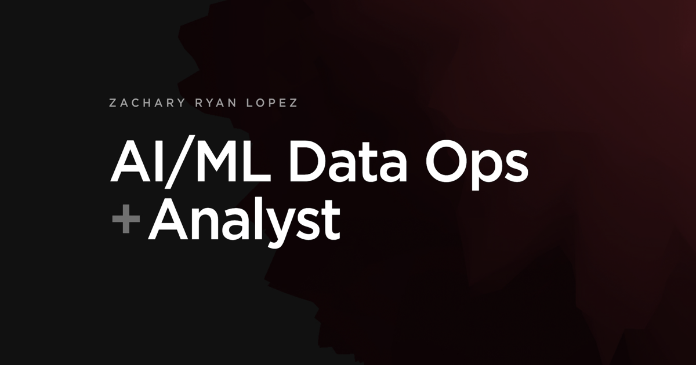

# zrl.dev

**[zrl.dev](https://zrl.dev)** — portfolio of **Zachary Ryan Lopez**, AI/ML Data Operations Analyst (Austin, TX).

Annotation QA, ML incident response, durable agent systems, and the tools behind them.

[](https://zrl.dev)
[](https://zrl.dev/tools)
[](https://github.com/zrlopez/zrl.dev/actions/workflows/secured_ci.yml)
[](https://app.codacy.com/gh/zrlopez/zrl.dev/dashboard?utm_source=gh&utm_medium=referral&utm_content=&utm_campaign=Badge_grade)
[](https://app.codacy.com/gh/zrlopez/zrl.dev/dashboard?utm_source=gh&utm_medium=referral&utm_content=&utm_campaign=Badge_coverage)
[](./LICENSE)

<p align="center">
  
</p>

## What’s here

| Path | |
|------|--|
| [`/`](https://zrl.dev/) | Intro, featured projects, profile |
| [`/projects`](https://zrl.dev/projects) | Project archive |
| [`/projects/annotation-dashboard`](https://zrl.dev/projects/annotation-dashboard#live-demo) | **Live** annotation analytics demo (6 tabs) |
| [`/projects/ai-agent-platform`](https://zrl.dev/projects/ai-agent-platform) | Cross-agent orchestration case study |
| [`/projects/ml-incident-response`](https://zrl.dev/projects/ml-incident-response) | MLOps incident / runbook system |
| [`/tools`](https://zrl.dev/tools) | Tools & Skills |
| [`/experience`](https://zrl.dev/experience) | Experience |
| [`/certifications`](https://zrl.dev/certifications) | Certifications |
| [`/contact`](https://zrl.dev/contact) | Contact (Turnstile + Resend) |

Also: [`/humans.txt`](https://zrl.dev/humans.txt) · [`/security`](https://zrl.dev/security) · [security.txt](https://zrl.dev/.well-known/security.txt)

## Stack

- **App:** Remix, React, Vite  
- **Motion / 3D:** Framer Motion, Three.js (Draco)  
- **Charts:** Recharts (annotation demo)  
- **Deploy:** Vercel (production) · Cloudflare DNS / edge  
- **Contact:** Cloudflare Turnstile · Resend · `contact@` / `no-reply@` on zrl.dev  

Visual system: Harvard Crimson `#A51C30` · Gotham + IPA Gothic.

## Develop

```bash
npm install
npm run dev          # http://127.0.0.1:5173
npm test
npm run build
```

Optional:

```bash
npm run dev:storybook
npm run lint
npm run type-check
```

Copy `.dev.vars.example` → `.dev.vars` for local contact / session secrets. Never commit real keys.

## Deploy

**Production:** Vercel tracks **`main`**.

**Cloudflare Pages** (optional / RateLimitKV path):

| Setting | Value |
|--------|--------|
| Build command | `npm run pages:build` (`CF_PAGES=1` → CF server shape) |
| Output directory | `build/client` |
| Functions | `functions/[[path]].js` → `build/server` |
| Node | `22` |
| Package manager | **npm** (not pnpm — `packageManager` is npm) |

```bash
npm run build
# or: npm run pages:build
```

Preview deploys on Vercel may require SSO.

## Credits

Layout foundation: [Hamish Williams](https://hamishw.com) portfolio (MIT).  
Content, case studies, systems, and imagery: Zachary Ryan Lopez.

## License

MIT — see [`LICENSE`](./LICENSE).
